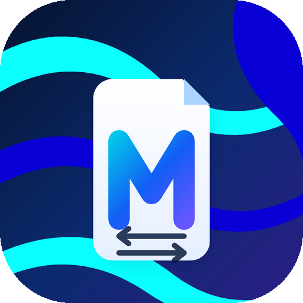
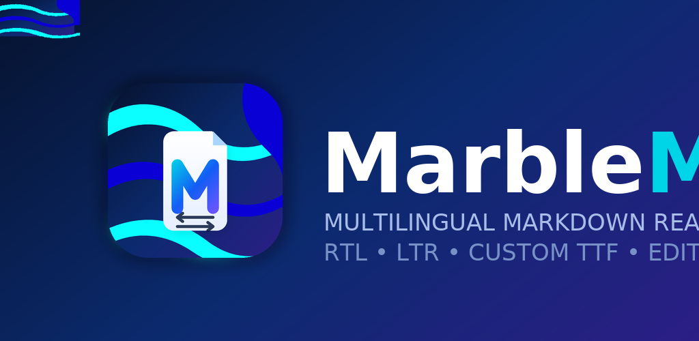
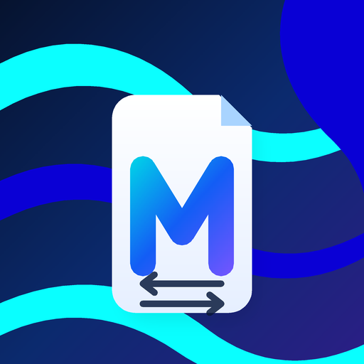

<div align="center">



# MarbleMD

**A native Android Markdown reader *and* editor built for multilingual, bidirectional text.**

[](https://github.com/marble098/marblemd/actions/workflows/android.yml)
[-3DDC84?logo=android&logoColor=white)](https://developer.android.com/)
[](https://kotlinlang.org/)
[](https://developer.android.com/jetpack/compose)
[](LICENSE)

Persian · العربية · کوردی · اردو · English · Русский · Ελληνικά · 日本語 · 中文

</div>

---

## ✨ امکانات

### 📖 خواندن حرفه‌ای Markdown
- پشتیبانی کامل **CommonMark + GFM**: جدول، task list، strikethrough، HTML، لینک، تصویر آنلاین، code block، نقل‌قول و لیست‌ها.
- رندر **بلوک‌به‌بلوک و Lazy**؛ اسناد بزرگ بدون فریز شدن UI و بدون مصرف بی‌رویه حافظه باز می‌شوند.
- انتخاب و کپی متن، لینک‌های قابل کلیک، line breaking با کیفیت بالا (`HIGH_QUALITY` + hyphenation).
- سه حالت جهت متن: **Auto / RTL / LTR** — در حالت Auto هر پاراگراف با `FIRST_STRONG` و `TEXT_ALIGNMENT_TEXT_START` بر اساس جهت واقعی خودش چیده می‌شود.
- شماره‌گذاری لیست‌های فارسی با ارقام فارسی و قرارگیری صحیح نشانه‌ها در متن راست‌به‌چپ.
- تغییر اندازه متن بین **۱۲sp تا ۳۴sp**.
- فهرست هوشمند (**Smart outline**) از هدینگ‌های سند با پرش سریع.
- دارک/لایت خودکار بر اساس سیستم + Edge-to-edge.

### 🕘 حافظه‌ی اسناد — دقیقاً از همان‌جایی که رها کردی
- **آخرین فایل‌های Markdown** در بخش «کتابخانه و بازدیدهای اخیر» با عنوان، زمان آخرین مطالعه، تعداد کاراکتر و پیش‌نمایش متن ذخیره می‌شوند.
- **محل مطالعه (اسکرول) برای هر سند جداگانه ذخیره می‌شود**؛ با باز کردن دوباره از لیست اخیرها، خواندن از همان بلوک ادامه پیدا می‌کند.
- در صفحه‌ی خوش‌آمد کارت **«Continue reading»** آخرین سند را با یک لمس ادامه می‌دهد.
- **نشست (Session)**: تب‌های باز، حتی متن ذخیره‌نشده، پس از بستن اپ یا چرخش صفحه بازگردانی می‌شوند؛ دیگر کار کسی هدر نمی‌رود.
- مدیریت کامل: حذف یک مورد از اخیرها، پاک‌کردن کل تاریخچه، بستن تب با هشدار برای اسناد ذخیره‌نشده.

### 🔤 فونت‌های کاملاً سفارشی (TTF / OTF)
- سه فونت داخلی: **Smart multilingual** (خودکار بین اسکریپت‌ها)، **Vazirmatn** برای فارسی/عربی و **Lalezar** برای تیتر.
- **افزودن فونت دلخواه کاربر**: از تنظیمات مطالعه → «Import .ttf / .otf» فایل فونت خودت را انتخاب کن.
- فایل فونت اعتبارسنجی می‌شود (خواندن مستقیم جدول `name` در SFNT)، نام واقعی خانواده فونت استخراج و فایل در حافظه‌ی خصوصی اپ کپی می‌شود؛ بنابراین با حذف فایل اصلی یا قطع دسترسی، فونت از کار نمی‌افتد.
- فونت سفارشی روی **متن خواندن، ویرایشگر و (به‌صورت اختیاری) کل رابط کاربری** اعمال می‌شود و برای اسکریپت‌هایی که پوشش نمی‌دهد از fallback خود اندروید استفاده می‌کند.
- تغییر نام/حذف فونت‌های اضافه‌شده با یک لمس.

### ✍️ ویرایشگر حرفه‌ای
- **ساخت فایل جدید Markdown** با قالب‌های آماده: Blank، Note، Article، README، Meeting notes، Changelog (با پیشنهاد نام فایل و انتخاب محل ذخیره روی دستگاه).
- ابزار ویرایش Markdown: تیترها، بولد، ایتالیک، strike، inline code، لینک، تصویر، نقل‌قول، لیست، لیست شماره‌دار، task list، code block، جدول و خط جداکننده.
- **Undo / Redo** با درست‌کردن خودکار تایپ‌های پشت‌سرهم در یک مرحله.
- **Find & Replace** کامل: شمارش تطبیق‌ها، قبلی/بعدی، حساس/غیرحساس به حروف بزرگ و کوچک، Replace و Replace all.
- **شماره‌ی خطوط** هم‌تراز با layout واقعی متن + **رنگ‌آمیزی سینتکس Markdown** حین تایپ.
- نوار وضعیت زنده: تعداد کلمه، کاراکتر و خط + موقعیت نشانگر (Ln/Col) + وضعیت ذخیره.
- ذخیره‌ی خودکار (debounced) برای فایل‌های قابل‌نوشتن و «Save as» با SAF.

### 🎨 آیکون و برند
- آیکون جدید و مدرن: یک **صفحه‌ی تاشده** به‌همراه مونوگرام **M** با گرادیان و **فلش‌های دوطرفه (RTL/LTR)** روی پس‌زمینه‌ی مرمری.
- **Adaptive icon** (API 26+) با لایه‌ی foreground/background و **monochrome** برای آیکون‌های تم‌دار اندروید ۱۳+.
- **نسخه‌ی vector قدیمی** برای API 24/25 و **بیت‌مپ در همه‌ی dpiها** (mdpi تا xxxhdpi، مربع و گرد) برای لانچرها و فروشگاه‌ها.
- همه‌ی دارایی‌ها با یک اسکریپت واحد ساخته می‌شوند: `python3 tools/generate-icons.py`.

### 🔄 به‌روزرسانی و توزیع
- بررسی خودکار **GitHub Releases** و دانلود APK متناسب با معماری دستگاه.
- تأیید امنیتی قبل از نصب: نام پکیج، `versionCode` و **اثر انگشت گواهی امضا** با نسخه‌ی نصب‌شده مقایسه می‌شود.
- GitHub Actions: تست + lint + ساخت APK امضاشده (universal و چهار معماری) + `SHA256SUMS.txt` + مانیفست `update.json` و انتشار خودکار در Releases.

---

## 📸 نمایی از برند

| اپ آیکون | فهرست ویژگی | بنر فروشگاه |
| --- | --- | --- |
|  |  |  |

لوگوی برداری: [`branding/marblemd-logo.svg`](branding/marblemd-logo.svg) — جزئیات سیستم برند در [`branding/README.md`](branding/README.md).

---

## 🚀 نصب

۱. از صفحه‌ی [Releases](https://github.com/marble098/marblemd/releases) آخرین APK را بگیر:
   - `MarbleMD-<version>-universal.apk` برای همه‌ی دستگاه‌ها
   - یا فایل مخصوص معماری خودت (`arm64-v8a`, `armeabi-v7a`, `x86_64`, `x86`) که حجم کمتری دارد.
۲. نصب کن و هر فایل `.md` را با MarbleMD باز کن (اپ به `ACTION_VIEW` و `ACTION_SEND` برای Markdown و متن ساده پاسخ می‌دهد).

---

## 🛠 ساخت از سورس

نیازمندی‌ها: JDK 17، Android SDK با `platforms;android-37.0` و `build-tools;37.0.0`.

```bash
gradle --no-daemon testDebugUnitTest lintDebug assembleRelease
```

فونت‌های داخلی در زمان build و توسط تسک `fetchFonts` از پروژه‌های OFL اصلی دانلود می‌شوند و داخل سورس commit نمی‌شوند. اگر شبکه در دسترس نبود، این فایل‌ها را دستی در `app/src/main/assets/fonts/` قرار بده:

| فایل | منبع |
| --- | --- |
| `Vazirmatn.ttf` | [rastikerdar/vazirmatn](https://github.com/rastikerdar/vazirmatn) |
| `NotoSans.ttf` | [google/fonts — Noto Sans](https://github.com/google/fonts/tree/main/ofl/notosans) |
| `Lalezar.ttf` | [google/fonts — Lalezar](https://github.com/google/fonts/tree/main/ofl/lalezar) |

### 🧪 تست‌ها

```bash
gradle --no-daemon testDebugUnitTest
```

تست‌های واحد بدون نیاز به دستگاه اجرا می‌شوند و منطق خالص اپ را پوشش می‌دهند: کدک حافظه‌ی اسناد، خواندن جدول `name` فونت‌های TrueType، تاریخچه‌ی undo/redo، رنگ‌آمیزی سینتکس Markdown، اکشن‌های ویرایشگر، پارس outline و دسته‌بندی اسکریپت‌های یونیکد.

---

## 🧱 ساختار پروژه

```
app/src/main/java/com/marblemd/app/
├── MainActivity.kt              # وضعیت اپ: تب‌ها، حافظه، فونت‌ها، به‌روزرسانی
├── editor/
│   ├── EditorHistory.kt         # undo/redo با ادغام تایپ‌های پشت‌سرهم
│   ├── MarkdownActions.kt       # ابزار درج/قالب‌بندی Markdown
│   └── MarkdownHighlighter.kt   # رنگ‌آمیزی سینتکس ویرایشگر
├── library/
│   ├── DocumentMemory.kt        # اخیرها + نشست + محل مطالعه
│   ├── DocumentMemoryCodec.kt   # کدک خالص و تست‌پذیر ذخیره‌سازی
│   └── MarkdownTemplate.kt      # قالب‌های فایل جدید
├── markdown/                    # موتور Markwon، پلن رندر بلوکی، outline
├── model/                       # MarkdownDocument، ReaderFont، جهت متن و ...
├── text/
│   ├── CustomFontStore.kt       # ایمپورت/حذف/نام‌گذاری فونت‌های کاربر
│   ├── TrueTypeName.kt          # خواننده‌ی جدول name در فونت (بدون وابستگی)
│   ├── FontRegistry.kt          # انتخاب typeface داخلی/سفارشی + fallback
│   └── ScriptFontApplier.kt     # اعمال فونت بر اساس اسکریپت هر بازه‌ی متن
├── ui/                          # ReaderScreen، MarkdownEditor، LibrarySheets، ...
└── update/UpdateManager.kt      # بررسی/دانلود/تأیید به‌روزرسانی

tools/generate-icons.py          # سازنده‌ی کامل آیکون‌ها و دارایی‌های برند
branding/                        # آیکون فروشگاه، بنر و لوگو
```

---

## 🌍 تایپوگرافی چندزبانه

| بخش متن | فونت در حالت Smart |
| --- | --- |
| Arabic (فارسی، عربی، اردو، کردی) | Vazirmatn |
| Latin / Greek / Cyrillic | Noto Sans |
| بقیه‌ی اسکریپت‌ها (CJK، Devanagari و ...) | استک fallback خود اندروید |
| متن داخل code span | فونت monospace (بدون تغییر) |

الگوریتم Bidi خود اندروید پایه‌ی چیدمان است، بنابراین متن ترکیبی فارسی/انگلیسی، ایموجی، عدد و علامت‌ها بدون به‌هم‌ریختگی نمایش داده می‌شوند.

---

## 🧩 معماری‌ها و سازگاری

- `compileSdk/targetSdk = 37`، `minSdk = 24`، AGP 9.3.0، Gradle 9.5.0، Kotlin/Compose Compiler 2.4.10، Compose BOM 2026.08.00.
- بدون کد native (`.so`)، بنابراین APK روی `arm64-v8a`, `armeabi-v7a`, `x86_64`, `x86` و معماری‌های سازگار یکسان اجرا می‌شود.
- `AndroidView` فقط برای `TextView`/Markwon استفاده شده تا Bidi و spanهای Markdown با بالاترین کیفیت حفظ شوند؛ بقیه‌ی رابط با Jetpack Compose و Material 3 ساخته شده است.

---

## 📄 License

MIT — فایل‌های فونت در زمان build از پروژه‌های OFL اصلی دانلود می‌شوند و در سورس نگه‌داری نمی‌شوند. فونت‌هایی که کاربر خودش اضافه می‌کند، فقط در حافظه‌ی خصوصی همان دستگاه می‌مانند.
